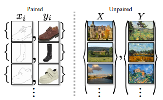
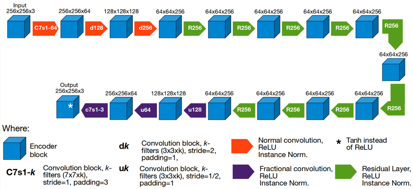
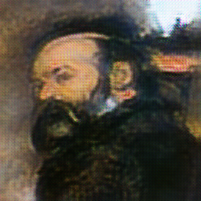
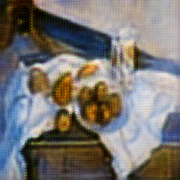

# CycleGAN Implementation

## Summary

This repository contains an implementation of CycleGAN, a deep learning model for unsupervised image-to-image translation, as described in the paper "Unpaired Image-to-Image Translation using Cycle-Consistent Adversarial Networks" by Zhu et al.

CycleGAN introduces an approach for unsupervised image-to-image translation, enabling the conversion of images from one domain to another without paired examples. It consists of two generators and two discriminators, where the generators learn to translate images from one domain to another and vice versa, while the discriminators distinguish between real and translated images. The key idea is to enforce cycle consistency, ensuring that the translated images can be mapped back to the original domain, preserving semantic content.

## Discussion

### CycleGAN: Unpaired Image-to-Image Translation using Cycle-Consistent Adversarial Networks

CycleGAN is a groundbreaking paper in the field of computer vision that introduces a novel approach to unpaired image-to-image translation. Traditional methods require paired images for training, which can be impractical or costly to obtain in many real-world scenarios. CycleGAN addresses this limitation by leveraging a cycle-consistency loss function to learn mappings between two domains without the need for paired data.

 

 

The core idea behind CycleGAN is the introduction of two generative adversarial networks (GANs), each dedicated to translating images between two distinct domains. The first GAN, known as the generator, learns to transform images from domain A to domain B, while the second GAN learns the inverse mapping from domain B to domain A. These generators are trained concurrently with their corresponding discriminators, which distinguish between real and translated images.

 

 
The key innovation of CycleGAN lies in its cycle-consistency loss, which enforces the property that translating an image from domain A to domain B and then back to domain A should yield the original image. By incorporating this cycle-consistency constraint into the training objective, CycleGAN learns to produce high-quality translations while preserving semantic content across domains.

The paper demonstrates the effectiveness of CycleGAN in various applications, such as style transfer, object transfiguration, and season transfer, showcasing its versatility and robustness in handling diverse image translation tasks.

## Methodology

To convert the CycleGAN paper to code, follow these steps:

1. **Generator and Discriminator Architectures**: Design the generator and discriminator networks for both image domains.
2. **Cycle Consistency Loss**: Implement the cycle consistency loss function to ensure that the translated images can be reconstructed back to the original images.
3. **Adversarial Loss**: Incorporate adversarial loss functions to train the generators to produce realistic images and the discriminators to distinguish between real and translated images.
4. **Training Procedure**: Train the CycleGAN model using unpaired image datasets from both domains, optimizing the combined loss function of cycle consistency and adversarial losses.
5. **Evaluation**: Assess the performance of the trained model by visualizing the translated images and evaluating their quality.

## Repository Structure

- `train.py`: Python script for training the CycleGAN model on unpaired image datasets.
- `generator.py`: Implementation of the generator network architecture.
- `discriminator.py`: Implementation of the discriminator network architecture.
- `utils.py`: Utility functions for saving and loading checkpoints.
- `A2Bdataset.py`: Custom dataset class for loading unpaired image datasets.
- `config.py`: Configuration file for setting hyperparameters and training configurations.
- `README.md`: Overview of the repository and instructions for usage.

## Results 

## References

- [Paper: Unpaired Image-to-Image Translation using Cycle-Consistent Adversarial Networks](https://arxiv.org/abs/1703.10593)
- [GitHub Repo: Official Implementation of CycleGAN](https://github.com/junyanz/pytorch-CycleGAN-and-pix2pix)
- [Blog: Understanding CycleGAN: Image Translation with Unpaired Data](https://machinelearningmastery.com/what-is-cyclegan/)
- [Blog: Cycle GAN with PyTorch](https://towardsdatascience.com/cycle-gan-with-pytorch-ebe5db947a99)
