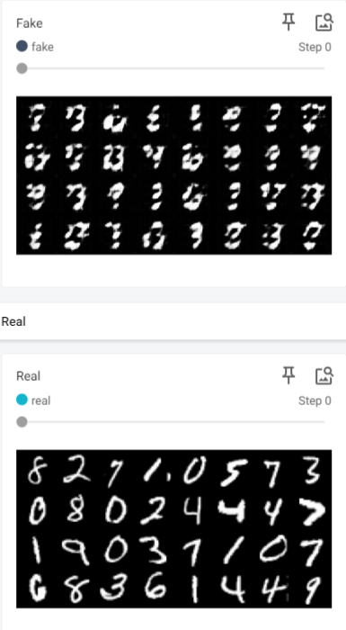

# DCGAN Implementation

## Summary

This section contains the implementation of the DCGAN (Deep Convolutional Generative Adversarial Network) paper in PyTorch. DCGAN is a seminal paper in the field of generative modeling, introducing a framework for training deep convolutional networks for image generation tasks.

The key contributions of the DCGAN paper include:

- Introduction of the DCGAN architecture: a framework for training deep convolutional networks for image generation tasks without relying on handcrafted features.
- Demonstration of stable training: DCGANs are shown to produce high-quality images across a variety of datasets and image categories.
- Exploration of image generation capabilities: DCGANs can generate realistic images across multiple domains, including faces, bedrooms, and street views.

## Methodology

The methodology for converting the DCGAN paper to code involves the following steps:

1. Understanding the DCGAN architecture: Familiarizing with the architecture of the generator and discriminator networks proposed in the DCGAN paper.
2. Data preprocessing: Prepare the dataset for training, ensuring proper resizing, normalization, and augmentation if necessary.
3. Model implementation: Implement the generator and discriminator networks using PyTorch, adhering closely to the architectural guidelines provided in the paper.
4. Adversarial training: Train the generator and discriminator networks using adversarial training, where the generator aims to produce realistic images while the discriminator aims to distinguish between real and fake images.
5. TODO: Optimization and evaluation: Optimize the generator and discriminator networks using appropriate optimization algorithms and evaluate the performance of the trained model on a separate validation set.

## Repository Structure

- `dcgan.py`: Python script containing the implementation of the DCGAN architecture.
- `train.py`: Script for training the DCGAN model.
<!-- - `generate_samples.py`: Script for generating samples using the trained generator.
- `requirements.txt`: List of Python dependencies for reproducing the environment. -->

## Results

## References

- Original DCGAN Paper: [Unsupervised Representation Learning with Deep Convolutional Generative Adversarial Networks](https://arxiv.org/abs/1511.06434)
- [PyTorch Documentation](https://pytorch.org/docs/stable/index.html)