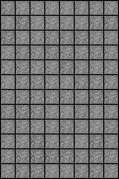
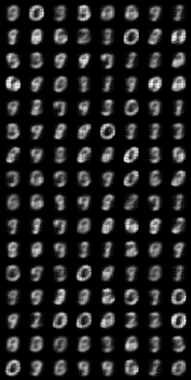

# Variational Autoencoder (VAE)

## Summary

This repository contains the code implementation of a Variational Autoencoder (VAE) in PyTorch. VAE is a type of generative model that learns to encode and decode high-dimensional data, such as images, into a lower-dimensional latent space. It is widely used for tasks like image generation, data compression, and representation learning.

## Discussion

Variational Autoencoders (VAEs) are a class of generative models that learn to generate data by mapping observed data points to a latent space where the data is approximately distributed according to a prior distribution, typically a Gaussian distribution. The model is trained using a variational inference approach, optimizing a lower bound on the data likelihood known as the evidence lower bound (ELBO). VAEs consist of an encoder network, which maps input data to the latent space, and a decoder network, which reconstructs the input data from samples drawn from the latent space. During training, VAEs aim to minimize the reconstruction error while regularizing the latent space to follow the prior distribution.

The original VAE paper by Kingma and Welling (2013) introduced the VAE framework, proposing a novel method for training generative models with latent variables. The paper presents a variational inference approach to learning deep generative models, enabling efficient approximate posterior inference and generation of new data samples. VAEs have since become a widely used framework for generative modeling, offering a principled approach to learning representations and generating diverse data samples.

## Methodology

To implement the VAE architecture in PyTorch, we follow the architecture described in the paper. The VAE consists of an encoder and a decoder, both implemented as neural networks. The encoder maps input data to the latent space, parameterizing the mean and variance of a Gaussian distribution. The decoder reconstructs the input data from samples drawn from this distribution. During training, we optimize the ELBO loss, which consists of a reconstruction loss and a KL divergence term that regularizes the latent space. We use the Adam optimizer for optimization and train the model for a fixed number of epochs. The implementation includes separate files for the model architecture (`model.py`), training script (`train.py`), and configuration parameters (`config.py`), following a modular structure for clarity and maintainability.

### Repo Structure

- `train.py`: Script for training the Linear VAE model.
- `model.py`: Contains the Linear VAE model architecture.
- `conv_model.py`: Contains the CNN VAE model architecture.
- `train_conv.py`: Script for training the CNN VAE model architecture.
- `config.py`: Configuration parameters for training the model.
- `results`: Contains the results from 20 epochs for both linear and cnn model training

### Results - 20 Epochs

Epoch 0| Linear Model | Conv Model |
-----|---------------|-----------------|
|||

### References:

- Kingma, D. P., & Welling, M. (2013). Auto-Encoding Variational Bayes. arXiv preprint arXiv:1312.6114. - https://arxiv.org/abs/1312.6114v10
- Blog post: https://jaan.io/what-is-variational-autoencoder-vae-tutorial/
- Video explanation: https://www.youtube.com/watch?v=P78QYjWh5sM
- Understanding Variational AutoEncoders - https://towardsdatascience.com/understanding-variational-autoencoders-vaes-f70510919f73
- Pytorch Implementation : https://youtu.be/VELQT1-hILo?si=isw-AJOsciSesdLy