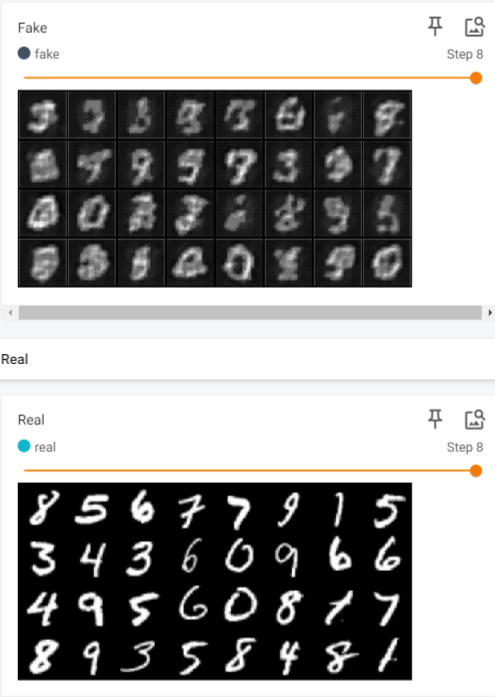
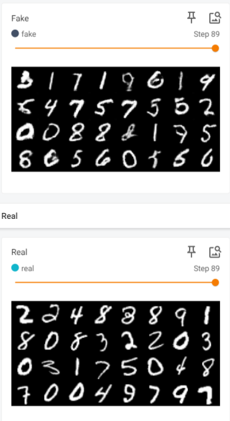

# WGAN with Gradient Penalty (WGAN-GP) Implementation

## Summary

This repository contains an implementation of the Wasserstein Generative Adversarial Network with Gradient Penalty (WGAN-GP) as described in the paper "Improved Training of Wasserstein GANs" by Gulrajani et al. The WGAN-GP extends the original WGAN by incorporating a gradient penalty term, resulting in more stable training and improved sample quality in generative modeling tasks.

## Discussion

The Wasserstein Generative Adversarial Network with Gradient Penalty (WGAN-GP) paper, authored by Gulrajani et al., addresses the limitations of traditional Generative Adversarial Networks (GANs) in achieving stable training and generating high-quality samples. While GANs have shown remarkable success in generating realistic images, they suffer from mode collapse and instability during training, hindering their practical utility. The WGAN-GP introduces a novel training objective based on the Wasserstein distance, which offers several advantages over the original GAN formulation.

One of the key innovations of the WGAN-GP is the inclusion of a gradient penalty term in the loss function, which enforces a Lipschitz constraint on the discriminator network. By penalizing the norm of the gradient of the discriminator's output with respect to its input, the WGAN-GP ensures smoothness in the discriminator's decision boundary, leading to more stable training dynamics and improved convergence properties. This regularization technique alleviates the need for manual weight clipping, which was prevalent in earlier GAN variants.

Furthermore, the WGAN-GP provides a theoretical framework for understanding the optimization landscape of GANs, offering insights into the behavior of the generator and discriminator networks during training. The gradient penalty term encourages the discriminator to behave as a 1-Lipschitz function, thereby mitigating the risk of vanishing gradients and mode collapse. Empirical results demonstrate that the WGAN-GP yields superior sample quality and diversity compared to traditional GANs, making it a promising approach for various generative modeling tasks.

## Methodology

To convert the WGAN-GP paper to code, follow these steps:

1. **Generator and Discriminator Architectures**: Design the generator and discriminator networks according to the guidelines provided in the paper.
2. **Wasserstein Loss Function with Gradient Penalty**: Implement the Wasserstein loss function with a gradient penalty term to be used during training.
3. **Training Procedure**: Train the WGAN-GP model using the Wasserstein loss function and appropriate optimization techniques, such as gradient clipping.
4. **Evaluation**: Assess the performance of the trained model using qualitative and quantitative metrics, such as sample quality and convergence stability.

## Repository Structure

- `WGAN_GP.py`: Python script containing the implementation of the Wasserstein GAN with Gradient Penalty model.
- `train.py`: Script for training the WGAN-GP model on a specific dataset.
- `utils.py`: Utility functions for gradient penalty.
- `datasets/`: Directory for storing training datasets.
<!-- - `results/`: Directory for saving generated images and trained model checkpoints. -->
- `README.md`: This file, providing an overview of the repository and instructions for usage.

## Results

## References
- [Paper: Improved Training of Wasserstein GANs](https://arxiv.org/abs/1704.00028)
- [Read-through: Wasserstein GAN by alexirpan](https://www.alexirpan.com/2017/02/22/wasserstein-gan.html)
