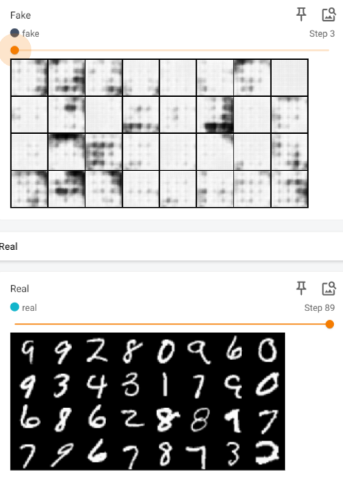
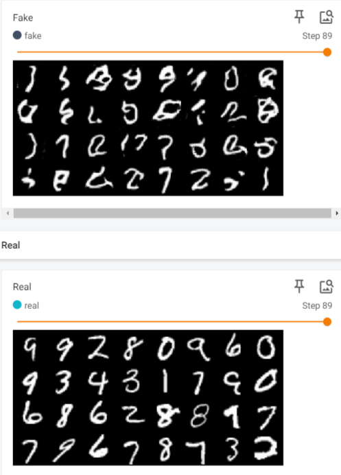

# WGAN Implementation

## Summary

This repository contains an implementation of the Wasserstein Generative Adversarial Network (WGAN) as described in the paper "Wasserstein GAN" by Arjovsky et al. The WGAN introduces a new training objective based on the Wasserstein distance, which leads to more stable training and improved sample quality in generative modeling tasks.

## Discussion

The Wasserstein Generative Adversarial Network (WGAN) introduces a groundbreaking approach to training generative models by leveraging the Wasserstein distance metric. Unlike traditional Generative Adversarial Networks (GANs), which rely on the Jensen-Shannon divergence or the Kullback-Leibler divergence for training, WGANs prioritize the Wasserstein distance as their objective function. This distance metric offers several advantages, particularly in addressing the instability and mode collapse issues commonly encountered in GAN training.

The core concept behind WGANs lies in optimizing the Wasserstein distance between the probability distributions of the generator and discriminator networks. This distance metric provides a more meaningful measure of the difference between distributions, leading to more stable training dynamics and mitigating the challenges associated with mode collapse, where the generator fails to capture the diversity of the target distribution.

By minimizing the Wasserstein distance, WGANs encourage smoother convergence and more consistent gradient flow during training, facilitating the generation of high-quality samples across various domains. Moreover, the theoretical grounding of the Wasserstein distance in optimal transport theory lends mathematical rigor to the training process, offering insights into the underlying geometry of the data distribution and guiding the optimization towards better convergence properties.

## Methodology

To convert the WGAN paper to code, follow these steps:

1. **Generator and Discriminator Architectures**: Design the generator and discriminator networks according to the guidelines provided in the paper.
2. **Wasserstein Loss Function**: Implement the Wasserstein loss function to be used during training, along with any necessary gradient penalty terms.
3. **Training Procedure**: Train the WGAN model using the Wasserstein loss function and appropriate optimization techniques, such as gradient clipping.
4. **Evaluation**: Assess the performance of the trained model using qualitative  metrics.

<!-- TODO: and quantitative metrics such as , such as sample quality and convergence stability. -->

## Repository Structure

- `WGAN.py`: Python script containing the implementation of the Wasserstein GAN model.
- `train.py`: Script for training the WGAN model on a specific dataset.
- `datasets/`: Directory for storing training datasets.
<!-- TODO:- `results/`: Directory for saving generated images and trained model checkpoints. -->
- `README.md`: This file, providing an overview of the repository and instructions for usage.

## Results

## References

- [Paper: Wasserstein GAN](https://arxiv.org/abs/1701.07875)
- [Paper Discussion - Read-through: Wasserstein GAN by alexirpan](https://www.alexirpan.com/2017/02/22/wasserstein-gan.html)